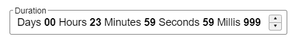

# react-duration-control

[](https://badge.fury.io/js/react-duration-control)



A time duration input component that allows the user to define a duration in days, hours, minutes, seconds and milliseconds.

A demo can be found [HERE](https://nikkorn.github.io/react-duration-control/)

## Install

```sh
$ npm install react-duration-control
```

## Usage

```tsx
import DurationControl from "react-duration-control";

import "react-duration-control/dist/react-duration-control.css";

const [millis, setMillis] = useState(0);

<DurationControl 
    label="Duration"
    pattern="Days {dd} Hours {hh} Minutes {mm} Seconds {ss} Milliseconds {fff}"
    value={millis} 
    onChange={setMillis}
/>
```
The backing value for the control is the number of milliseconds represented by the units included in the control pattern and their quantities.

## Props

| Prop | Type | Default | Description |
| ---- | ---- | ------- | ----------- |
| value | number | | The value of the control in milliseconds. |
| onChange | func  | | Callback fired when the value in milliseconds is changed. The value is passed as the first and only argument. `(millis: number) => void` |
| pattern | string || The pattern used to construct the control contents, defining both the static inline text and inline unit input controls. The pattern will be parsed for any units which are defined using one or more duration unit characters `(d=day/h=hour/m=minute/s=second/f=millisecond)` wrapped in curly brackets. Any parsed units will be substitued with an inline unit input box which is displayed when the unit value is clicked on in the control. Any unit values will be padded with zeros, the number of which being defined by the number of duration unit characters used. Any part of the pattern that does not match the duration unit syntax will be treated as static inline text. |
| label | string | | The control label content. |
| disabled | bool | `false` | If `true`, the control will be disabled. |
| hideSpinner | bool | `false` | If `true`, the up and down spinner buttons will not be shown. |
| rollover | bool    | `false` | If `true`, it allows unit values (e.g., minutes, hours) to roll over to the next higher unit. For example: <br/> - Typing 59 into the minutes field and incrementing by 1 will reset the minutes to 0 and increment the hours by 1. <br/> - Typing 65 into the minutes field will reset the minutes to 5 and increment the hours by 1. |
| touchFriendly | bool | `false` | If `true`, the control will be rendered in a touch-friendly mode where any touch target areas will be made larger. |